# Plotting
```
from matplotlib.pyplot import subplots

# fig, ax = subplots(figsize=(8, 8))
fig, axes = subplots(nrows=2,
                     ncols=3,
                     figsize=(15, 5))
# fig.set_size_inches(12,3)
x = rng.standard_normal(100)
y = rng.standard_normal(100)

ax.plot(x, y);
ax.scatter(x, y, marker='o');

f = np.multiply.outer(np.cos(y), 1 / (1 + x**2))
ax.contour(x, y, f, levels=45);
ax.imshow(f, extent=(np.min(x), np.max(x), np.min(y), np.max(y)))

ax.set_xlabel("this is the x-axis")
ax.set_ylabel("this is the y-axis")
ax.set_title("Plot of X vs Y");


Auto.hist('mpg', color='red', bins=12, ax=ax);
grouped.boxplot(subplots=False, column='mpg')
Auto.boxplot('mpg', by='cylinders', ax=ax)

fig.savefig("Figure.png", dpi=400)


# Scatter matrix
pd.plotting.scatter_matrix(Auto);
pd.plotting.scatter_matrix(Auto[['mpg',
                                 'displacement',
                                 'weight']]);
```

#  Arrays
```
x_reshape = x.reshape((2, 3))
---
    x = [1 2 3 4 5 6]
    reshaped x:
     [[1 2 3]
     [4 5 6]]
```
```
x = np.linspace(-np.pi, np.pi, 50) # 50 valores entre -pi y pi
seq2 = np.arange(0, 10, 2) # valores entre 0 y 10 con paso de 2
```
```
A = np.array(np.arange(16)).reshape((4, 4))
    array([[ 0,  1,  2,  3],
       [ 4,  5,  6,  7],
       [ 8,  9, 10, 11],
       [12, 13, 14, 15]])

A[[1,3]] # 2da y 4ta FILA
A[:,[0,2]]  # 2da y 4ta COLUMNA, todas las filas.
np.array([A[1,0],A[3,2]]) # submatrix
idx = np.ix_([1,3],[0,2,3]) # submatrix from a "mesh" object
--> A[idx] # use mesh object.
A[np.array([False,True,False,True])] # Sólo muestra 2da y 4ta fila 
```

# Pandas
```
Auto.dropna()
Auto.columns # list column names
np.unique(Auto['horsepower'])
Auto['horsepower'].sum()

Auto_re = Auto.set_index('name')

idx_80 = Auto['year'] > 80 # mesh
Auto[idx_80]

Auto_re.loc[lambda df: (df['displacement'] < 300)
                       & (df.index.str.contains('ford')
                       | df.index.str.contains('datsun')),
            ['weight', 'origin']
           ]


Auto[['mpg', 'horsepower']]

rows = ['amc rebel sst', 'ford torino'] # Loc rows (by index)
Auto_re.loc[rows]
Auto_re.loc['ford galaxie 500', ['mpg', 'origin']]

Auto_re.iloc[[3,4]] # by position


Auto.cylinders = pd.Series(Auto.cylinders, dtype='category') # categorical data


grouped = Auto.groupby(by='cylinders')
grouped.groups
grouped.boxplot(subplots=False, column='mpg')
Auto.boxplot('mpg', by='cylinders', ax=ax)

Auto[['mpg', 'weight']].describe()

```

# Data loading
```
import pandas as pd
Auto = pd.read_csv('../datasets/Auto.csv')
Auto = pd.read_csv('../datasets/Auto.data', delim_whitespace=True, na_values=['?'])

```

# Muestras aleatorias
- Fijar un nrg: `rng = np.random.default_rng(1303)`

```
np.random.normal(loc=0, scale=1, size=50) # N(0,1)
rng.normal(loc=0, scale=1, size=50) # N(0,1)

X = rng.standard_normal((10, 3))
----
    array([[ 0.22578661, -0.35263079, -0.28128742],
           [-0.66804635, -1.05515055, -0.39080098],
           [ 0.48194539, -0.23855361,  0.9577587 ],
           [-0.19980213,  0.02425957,  1.54582085],
           [ 0.54510552, -0.50522874, -0.18283897],
           [ 0.54052513,  1.93508803, -0.26962033],
           [-0.24355868,  1.0023136 , -0.88645994],
           [-0.29172023,  0.88253897,  0.58035002],
           [ 0.0915167 ,  0.67010435, -2.82816231],
           [ 1.02130682, -0.95964476, -1.66861984]])
```
## Permutating
```
indices = np.random.permutation(len(iris.target)) #permutes np.array(len(iris.target))
```


## Statistics
`np.mean(y), y.mean()`
`np.var(y), np.mean((y - y.mean())**2)`
`np.std(y), y.std()`


# Correlación
```
np.corrcoef(x, y)
----
    array([[1.        , 0.99864319],
           [0.99864319, 1.        ]])
```


# sklearn

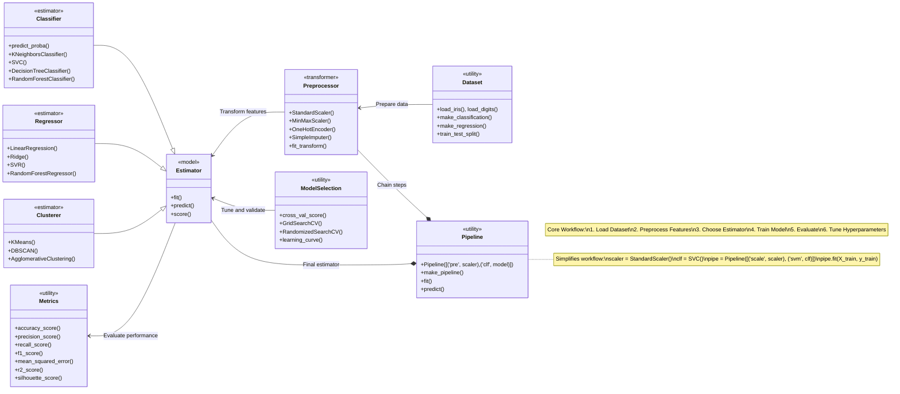


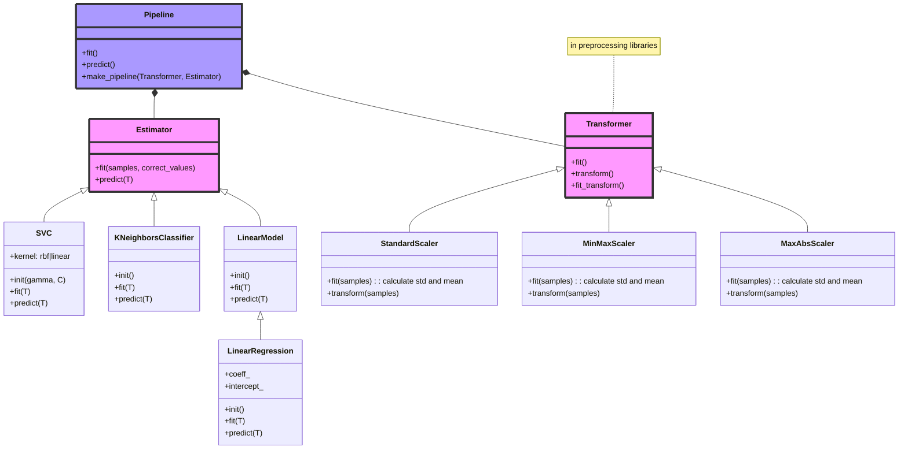

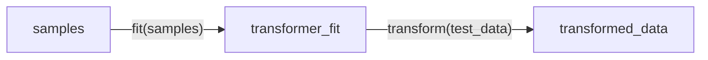
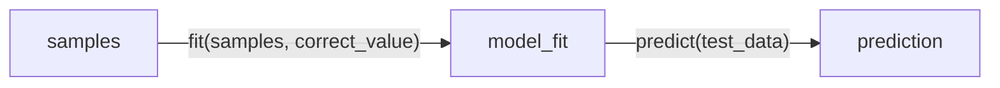
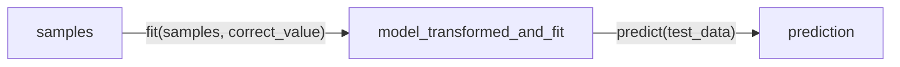

MSE: `np.mean((regr.predict(diabetes_X_test) - diabetes_y_test)**2)`
R^2(score): `regr.score(diabetes_X_test, diabetes_y_test`

## model_selection
```
from sklearn.model_selection import train_test_split
y_df = iris_df.target
X_train, X_test, y_train, y_test = train_test_split(X_df, y_df, stratify=y_df, random_state=0)
```

- `BaseCrossValidator`: Abstract base for deterministic splitters (e.g., KFold)
- `BaseShuffleSplit`: Base for randomized splitters (e.g., ShuffleSplit)
- `BaseSearchCV`: Base for hyperparameter tuners

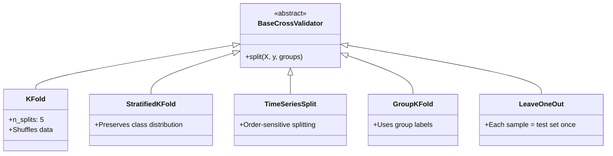
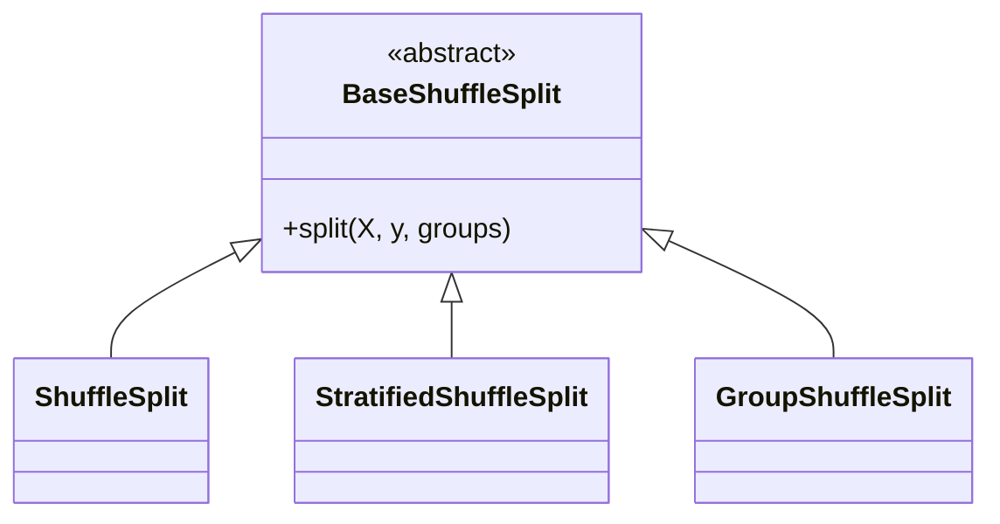
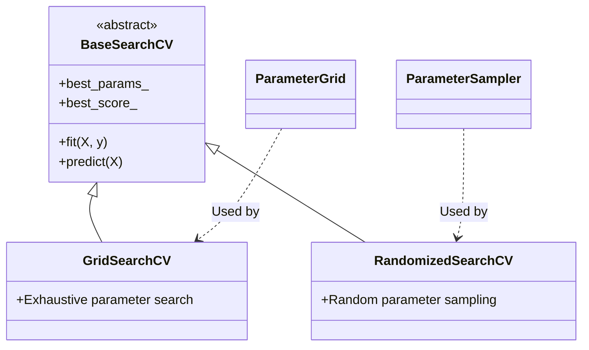
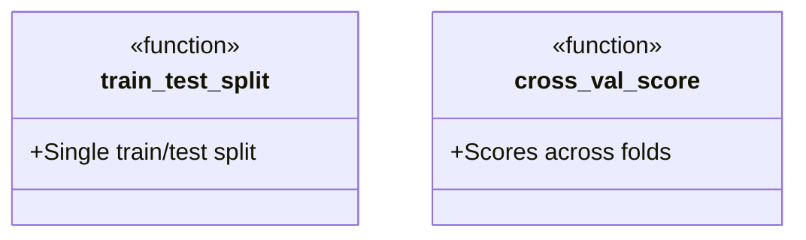

### Linear model
```
from sklearn import linear_model
regr = linear_model.LinearRegression()
regr.fit(diabetes_X_train, diabetes_y_train)
print(regr.coef_, regr.intercept_)
regr.score(diabetes_X_test, diabetes_y_test)


mse = metrics.mean_squared_error(y_train, y_pred)
rmse = np.sqrt(mse)  # rse
r2 = metrics.r2_score(y_train, y_pred) #r-squared metric
adjusted_r2 = 1 - (1 - r2) * (n - 1) / (n - p - 1) #adjusted r-squared metric
```

```mermaid
classDiagram
    direction BT
    
    class LinearModel {
        <<abstract>>
        +coef_
        +intercept_
        +fit(X, y)
        +predict(X)
    }
    
    class RegularizedLinearModel {
        <<abstract>>
        +alpha: Regularization strength
    }
    
    class LinearRegression {
        +OLS (Ordinary Least Squares)
        +No regularization
    }
    
    class Ridge {
        +L2 regularization
        +Good for multicollinearity
    }
    
    class Lasso {
        +L1 regularization
        +Feature selection
    }
    
    class ElasticNet {
        +L1 + L2 regularization
        +l1_ratio controls mix
    }
    
    class BayesianRidge {
        +Bayesian approach
        +Automatic regularization
    }
    
    class HuberRegressor {
        +Robust to outliers
        +Combines L2/L1 loss
    }
    
    class SGDRegressor {
        +Stochastic Gradient Descent
        +Supports various losses
    }
    
    class GLM {
        <<abstract>>
        +Generalized Linear Model
    }
    
    class LogisticRegression {
        +Classification (binary/multi)
        +Logit loss
    }
    
    class PoissonRegressor {
        +Count data regression
        +Log-link function
    }
    
    class QuantileRegressor {
        +Models quantiles (e.g., median)
        +Robust to outliers
    }
    
    class MultiOutputModel {
        <<abstract>>
        +Handles multiple targets
    }
    
    LinearModel <|-- LinearRegression
    LinearModel <|-- RegularizedLinearModel
    RegularizedLinearModel <|-- Ridge
    RegularizedLinearModel <|-- Lasso
    RegularizedLinearModel <|-- ElasticNet
    LinearModel <|-- BayesianRidge
    LinearModel <|-- HuberRegressor
    LinearModel <|-- SGDRegressor
    LinearModel <|-- GLM
    GLM <|-- LogisticRegression
    GLM <|-- PoissonRegressor
    GLM <|-- GammaRegressor
    GLM <|-- TweedieRegressor
    LinearModel <|-- QuantileRegressor
    LinearModel <|-- MultiOutputModel
    MultiOutputModel <|-- MultiTaskLasso
    MultiOutputModel <|-- MultiTaskElasticNet
    
    class CVModel {
        <<abstract>>
        +Automated hyperparameter tuning
    }
    
    Ridge <|-- RidgeCV
    Lasso <|-- LassoCV
    ElasticNet <|-- ElasticNetCV
    LogisticRegression <|-- LogisticRegressionCV
    Lars <|-- LarsCV
    OrthogonalMatchingPursuit <|-- OrthogonalMatchingPursuitCV
    class RidgeCV {
        +Cross-validated alpha
    }
    class LassoCV {
        +Cross-validated alpha
    }
    class Lars {
        +Least Angle Regression
    }
    class OrthogonalMatchingPursuit {
        +Greedy sparse approximation
    }
```

- Basic linear modeling: LinearRegression
- Feature selection: Lasso or LassoCV
- Multicollinearity issues: Ridge or BayesianRidge
- Classification tasks: LogisticRegression
- Count data: PoissonRegressor
- Outlier resistance: HuberRegressor or RANSACRegressor
- Large datasets: SGDRegressor
- Multi-output regression: MultiTaskElasticNet


## metrics

```mermaid
classDiagram
    direction BT
    
    class Metric {
        <<abstract>>
        +compute(y_true, y_pred)
    }
    
    class ClassificationMetric {
        <<interface>>
    }
    
    class RegressionMetric {
        <<interface>>
    }
    
    class ClusteringMetric {
        <<interface>>
    }
    
    class PairwiseMetric {
        <<interface>>
    }
    
    Metric <|-- ClassificationMetric
    Metric <|-- RegressionMetric
    Metric <|-- ClusteringMetric
    Metric <|-- PairwiseMetric
    
    class AccuracyScore {
        +binary/multiclass
        +params: normalize, sample_weight
    }
    
    class PrecisionScore {
        +params: average, zero_division
        +micro/macro/weighted
    }
    
    class RecallScore {
        +params: average, zero_division
        +related to sensitivity
    }
    
    class F1Score {
        +harmonic mean(precision, recall)
        +params: average
    }
    
    class RocAucScore {
        +params: average, multi_class
        +ovo/ovr strategies
    }
    
    class ConfusionMatrix {
        +visualize with ConfusionMatrixDisplay
        +TP, TN, FP, FN counts
    }
    
    class MeanSquaredError {
        +params: squared, multioutput
        +RMSE when squared=False
    }
    
    class R2Score {
        +coefficient of determination
        +params: force_finite
    }
    
    class AdjustedRandScore {
        +clustering comparison
        +adjusted for chance
    }
    
    class SilhouetteScore {
        +measures cluster cohesion
        +range: [-1, 1]
    }
    
    class CosineSimilarity {
        +text/image applications
        +params: dense_output
    }
    
    class MakeScorer {
        +wrapper for custom metrics
        +params: greater_is_better
    }
    
    ClassificationMetric <|.. AccuracyScore
    ClassificationMetric <|.. PrecisionScore
    ClassificationMetric <|.. RecallScore
    ClassificationMetric <|.. F1Score
    ClassificationMetric <|.. RocAucScore
    ClassificationMetric <|.. ConfusionMatrix
    RegressionMetric <|.. MeanSquaredError
    RegressionMetric <|.. R2Score
    ClusteringMetric <|.. AdjustedRandScore
    ClusteringMetric <|.. SilhouetteScore
    PairwiseMetric <|.. CosineSimilarity
    Metric <|.. MakeScorer
```

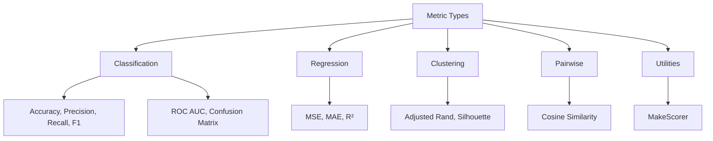
## transformers
```
from sklearn.preprocessing import StandardScaler
my_std_scaler = StandardScaler()
Xt = my_std_scaler.fit(X).transform(X)
```
```
from sklearn.preprocessing import MinMaxScaler
min_max_scaler = MinMaxScaler()
x_train_minmax = min_max_scaler.fit_transform(X_train)
x_train_minmax
```

## pipelines
Chain de transformers+predictors con el mismo api que un estimador.

```
pipeline = sklearn.pipeline.make_pipeline(
                        sklearn.preprocessing.StandardScaler(),
                        sklearn.linear_model.LogisticRegression()
                        )
pipeline.fit(X_train, y_train)
```

## inspection
```
from sklearn.inspection import DecisionBoundaryDisplay
DecisionBoundaryDisplay.from_estimator(
                                    knn,
                                    X_test,
                                    response_method="predict",
                                    plot_method="pcolormesh",
                                    xlabel=iris.feature_names[0],
                                    ylabel=iris.feature_names[1],
                                    shading="auto",
                                    alpha=0.5,
                                    ax=ax,
                                    )
```

## sklearn datasets
```
from sklearn import datasets
iris = datasets.load_iris()
print(digits.data) #n_samples, n_features array
print(digits.DESCR)
```


 ```
clf = svm.SVC(gamma=0.001, C=100.)
clf.fit(iris.data, iris.target)
clf.fit(iris.data, iris.target_names[iris.target]) # classes with names
clf.predict(iris.data[:3])
```

## statsmodels
```
import statsmodels.api as sm
# X tiene que tener una columna de 1s.
# ejemplo:
X = pd.DataFrame({'intercept': np.ones(Boston.shape[0]), # A vector of 506 ones.
                  'lstat': Boston['lstat']})

# y ahora con ese X con una columna de 1s (los intercept):
model = sm.OLS(y,X) # notar el orden
results = model.fit()

print('--> params: \n', results.params)
print('--> tvalues: \n', results.tvalues)

results.summary()

# New predictions:
new_predictions = results.get_prediction(newX);
new_predictions.predicted
new_predictions.predicted_mean


# To get p-values and t-tests:
results.t_test([0,1])
results.t_test([1,0])

# Confidence interval:
results.conf_int(alpha=0.05)
```

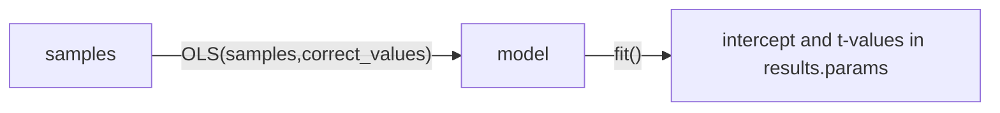

# ILS
```
Boston = load_data("Boston")

# Agregar una columna de 1s
X = pd.DataFrame({'intercept': np.ones(Boston.shape[0]), # A vector of 506 ones.
                  'lstat': Boston['lstat']})

import statsmodels.api as sm
X_with_add_constant = sm.add_constant(Boston['lstat'])

# With resuls from a statsmodels model:
summarize(results)

# ModelSpec, MS, que es un transform.
design = MS(['lstat']) 
design = design.fit(Boston)
X = design.transform(Boston)

```